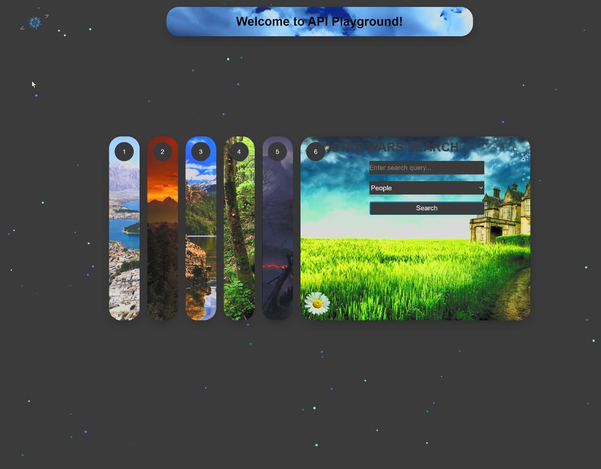

# APIs Playground 

This exercise is a boilerplate forked from Dev Academy to play around with APi's and how they work. You can find the original repo [here](https://github.com/manaia-2023/consuming-external-apis).

## Summary

Welcome to Api-Playground! This repository serves as a playground for experimenting with various APIs, showcasing different features and functionalities. Below, you'll find a summary of the six cards included in this playground, each highlighting a different API integration:

## The Cards 

1. **Open-Meteo Weather API:** Get real-time weather updates for Dunedin, Otago, using the Open-Meteo API.

2. **Afformations API:** Explore affirmations and positive messages using the Afformations API.

3. **Audio Player with Visualization:** Experience an interactive audio player with colorful visualization. Upload your own WAV files to customize your music experience.

4. **Marvel API Integration:** Dive into the Marvel universe with access to comics descriptions and images via the Marvel API.

5. **Giphy API Search:** Search and discover GIFs using the Giphy API's powerful search functionality.

6. **Star Wars API:** Explore details and trivia from the vast Star Wars universe using the Star Wars API.

Feel free to explore each card to learn more about how these APIs can be utilized and integrated into your projects.

## Demo

  

<h2>Thank you!</h2>

